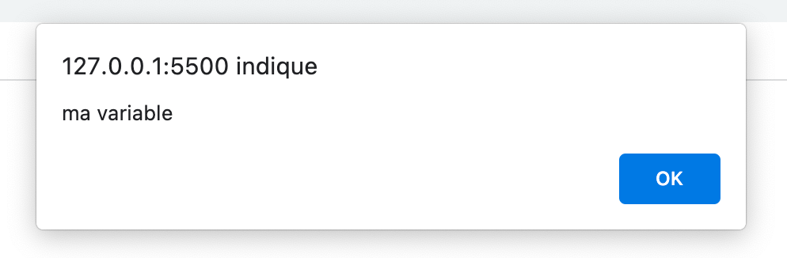

# <p align= "center"> Cours de JavaScript  </p>
   ## <p align= "center"> Intoduction au JavaScript </p>  
<<<<<<< HEAD
   **JavaScript** est un langage de programmation qui permet de créer du contenu mis à jour de façon dynamique, de contrôler le contenu multimédia, d'animer des images, et tout ce à quoi on peut penser. Bon, peut-être pas tout, mais vous pouvez faire bien des choses avec quelques lignes de JavaScript.  
   ## <p align= "center"> Une variable?? </p>  
   **JavaScript** est un langage de programmation qui permet de créer du contenu mis à jour de façon dynamique, de contrôler le contenu multimédia, d'animer des images, et tout ce à quoi on peut penser. Bon, peut-être pas tout, mais vous pouvez faire bien des choses avec quelques lignes de JavaScript.  
=======
   **JavaScript** est un langage de programmation qui permet de créer du contenu mis à jour de façon dynamique, de contrôler le contenu multimédia, d'animer des images, et tout ce à quoi on peut penser. Bon, peut-être pas tout, mais vous pouvez faire bien des choses avec quelques lignes de JavaScript.
>>>>>>> 41da08bd13d0f928409176c94c929f62dce0fddf


```var maChaine = new String("")
var a = 42;
var b = 4.2;
var c = -42;
var d = "42";

alert("ma variable a est de type : " + typeof(a) +
"\nma variable b est de type : " + typeof(b) +
"\nma variable c est de type : " + typeof(c) +
"\nma variable d est de type : " + typeof(d)
)


La méthode alert() de JavaScript m'affiche une fenêtre
)




# Titre
## titre
### titre
#### titre
##### titre
###### titre
texte
> section
>
> ca part de ca !!
> **en gras**

quand j'ecri du texte
et ca donne ca

**gras**

***italique***

*italique*

1. numero 1
2. numero 2
3. numero 3

> section
>
> > avec section

1. num1
   1. sou num
      1. a
      2. b
      3. c
2. num 2


- bullet 1
  - sous bullet 1
    - ldkschsd
      - caree
  


- bullet 2
- bullet 3


        <html>
        <head>
        <title>Test</title>
        </head>
        toto

My favorite search engine is [Duck Duck DO](http://duckduck.com).


Une image 


***
des lignes!
***
     

> section
